### Synopsis

Xiaomi released their new logo today and it is said that this was charged RMB 2 million.

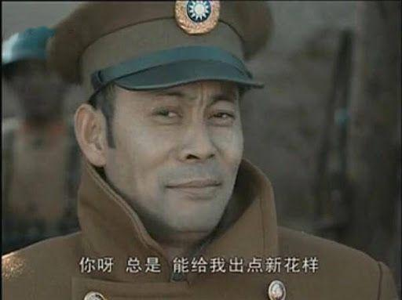

Mr Leibs always does good at marketing.


There are also rumors that one-line code is not worth 2 million.


I would rather say Leibs is doing marketing more than coding -- Xiaomi is now on the top search just by changing a logo. When it comes to the upcoming release of Xiaomi cars, you have to admit Leibs did a great job at the very moment.

### Really that simple?

Outsiders see the outside, insiders see the inside.

You may not be familiar with the designer **Kenya Hara(はら けんや)**.


But you must have heard about his design. Yes, he is the CAO of MUJI.


I was pushed to take another look at the two-million-RMB logo. Indeed, I found some clues.

First of all, the logo is not just corner-rounded by one line code, as the comparison below.


Even weak-eyed people could tell the difference. Simply speaking, the left one is corner-rounded, while the right one is apparently not.

Double checked the design idea. The logo follows the Lamé curve in Cartesian coordinate system, which is named superellipse also as below.

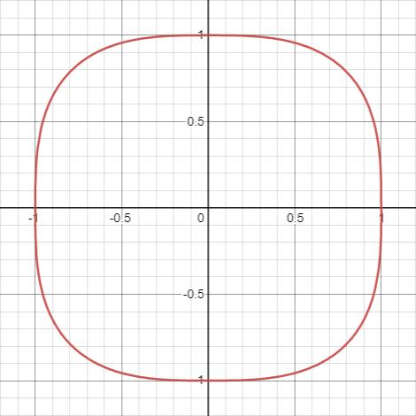

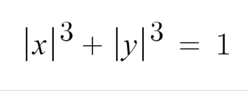

So here is the question. How to implement superellipse by CSS?

### Implement superellipse by CSS

Let's compare superellipse with rounded corner.

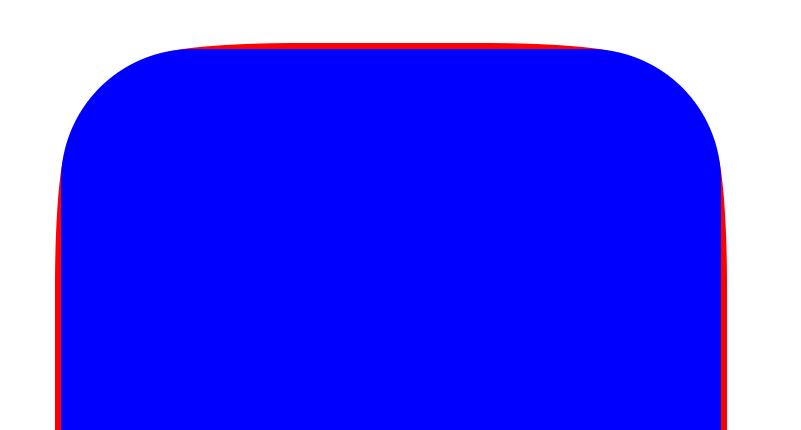

The biggest difference is the bulge part in red. If you have experience in PS and pencil tool, you will know this could be done by adjusting the length of axis of tangent line. It is okay if you know nothing about PS. In other word, the rounded corner is not the part of perfect circle, but ellipse instead.

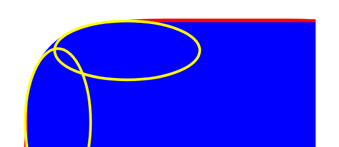

How to use `border-radius` to have a ellipsed corner which has different axis length? Let's go back to docs.

There is a line of small text on MDN docs referred to `border-raiuds` followed optionally by "/" and one, two, three, or four or values. This is used to set an additional radius, so you can have elliptical corners.

That is, the value before `/` is the length of h axis, the value after / is the length of v axis.

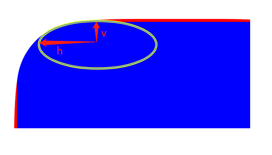

Try to implement this kind of rounded corner.

```
.super-ellipse {
  border-radius: 30% / 2%;
  height: 220px;
  position: relative;
  width: 220px;
}
```

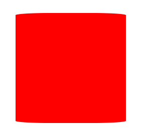

It seems to be so. But obviously only the top and bottom sides of the rectangle are bulged because this method can only define the `h/v` of one pair of rectangle sides to be bulged. To do so in the other pair of rectangle sides, the easiest way is using pseudo elements.

```
.super-ellipse {
  height: 220px;
  position: relative;
  width: 220px;
}

.super-ellipse::after,
.superellipse::before {
  background-color: red;
  content: "";
  position: absolute;
  z-index: -1;
}

.super-ellipse::before {
  border-radius: 2% / 30%;
  bottom: 0;
  left: 0;
  right: 0;
  top: 0;
}

.super-ellipse::after {
  border-radius: 30% / 2%;
  left: 0;
  right: 0;
  top: 0;
  bottom: 0;
}
```


There will also be a problem by doing this. That is, the bulged part is covered by the other pseudo element. Let's adjust the height and width of pseudo elements.

```
.super-ellipse {
  height: 220px;
  position: relative;
  width: 220px;
}

.super-ellipse::after,
.superellipse::before {
  background-color: red;
  content: "";
  position: absolute;
  z-index: -1;
}

.super-ellipse::before {
  border-radius: 2% / 30%;
  bottom: 33px;
  left: 0;
  right: 0;
  top: 33px;
}

.super-ellipse::after {
  border-radius: 30% / 2%;
  bottom: 0;
  left: 33px;
  right: 33px;
  top: 0;
}
```


Here comes the Red Cross, which is actually very similiar. At last, we set `border-radius` and color of parent node, and tune the position of pseudo elements. Oh, don't forget the Mi's color.

```
.super-ellipse {
  background-color: #ff6700;
  border-radius: 20%;
  height: 220px;
  position: relative;
  width: 220px;
}

.super-ellipse::after,
.superellipse::before {
  background-color: #ff6700;
  content: "";
  position: absolute;
  z-index: -1;
}

.super-ellipse::before {
  border-radius: 2% / 30%;
  bottom: 33px;
  left: -2px;
  right: -2px;
  top: 33px;
}

.super-ellipse::after {
  border-radius: 30% / 2%;
  bottom: -2px;
  left: 33px;
  right: 33px;
  top: -2px;
}
```


Almost the same, except for the MI logo text.

<a href="https://codepen.io/alexanderzhao/pen/jOyyNKR" target="_blank">Demo</a>

### Almost the same?

I do believe some PMs hold the idea that "production must perfectly fit the design prototype". I have to admit that the production above is almost the same, but not perfectly.

The reason is there is no overlapping between elliptic curve and non-quadratic Lamé curve in Cartesian coordinate system. Therefore, no matter how you adjust `border-radius` you cannot have a non-quadratic Lamé curve.

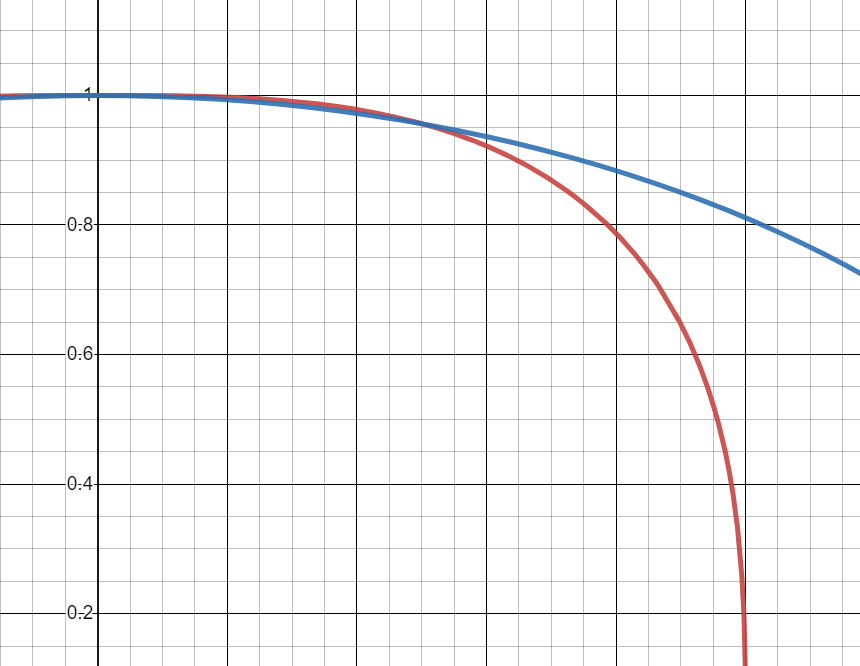

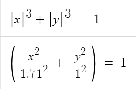

Thus, is there a way to draw a rectangle corners as function graph?

My intuition was telling me using `canvas`. Consider the idea of calculus, to link all the possible points.

In the initial version I just tried linking all the points by straight lines. The shape is not filled and heavily sawtoothed.

```
const canvas = document.getElementById('canvas');
const ctx = canvas.getContext('2d');

const width = 240;
const height = 240;
const calcY = x => ((width / 2)**3 - x**3)**(1 / 3)

ctx.setTransform(1, 0, 0, 1, width / 2 + 8, height / 2 + 8);
ctx.strokeStyle = '#ff6700';
ctx.moveTo(-width / 2, 0);

for (let i = -width / 2; i <= width / 2; i++) {
  const j = calcY(Math.abs(i));
  ctx.lineTo(i, j);
  ctx.stroke();
}


for (let i = width / 2; i >= -width / 2; i--) {
  const j = -calcY(Math.abs(i));
  ctx.lineTo(i, j);
  ctx.stroke();
}
```

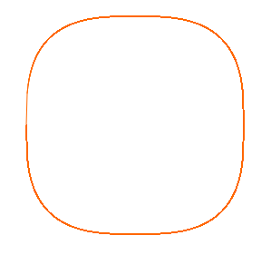

Well, smoother. Let's hire Bézier curve and get it done.

```
const canvas = document.getElementById('canvas');
const ctx = canvas.getContext('2d');

const width = 240;
const height = 240;
const calcY = x => ((width / 2)**3 - x**3)**(1 / 3)

ctx.setTransform(1, 0, 0, 1, width / 2 + 8, height / 2 + 8);
ctx.beginPath()
ctx.moveTo(width / 2 + 8, 0);

for (let i = -width / 2; i <= width / 2; i++) {
  const j = calcY(Math.abs(i));
  ctx.bezierCurveTo(i, j, i, j, i, j);
}

for (let i = width / 2; i >= -width / 2; i--) {
  const j = -calcY(Math.abs(i));
  ctx.bezierCurveTo(i, j, i, j, i, j);
}

ctx.closePath();
ctx.fillStyle = '#ff6700';
ctx.fill();
```

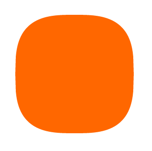

### Think more

Suddenly a troll shouts: `canvas` is not CSS.

Well, you are genius.


`canvas` is indeed HTML element. So is there any method to define drawing path in CSS like in `canvas`?

After some research, I found CSS Houdini, which is born in 2016, could handle this problem.

CSS Houdini gives developers the power to extend CSS by a set of low-level APIs that exposes parts of the CSS engine. This Houdini name can be found in lots of areas, most of which are related to visual effects, in memory of Harry Houdini, the greatest illusionist.

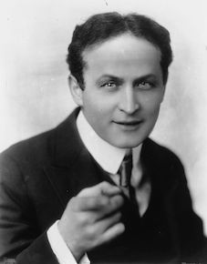

CSS Houdini provides 6 sets of APIs, of which the Paint API could work. We can use Paint API to define properties of `background`, then to have ellipse effect by sheltering. Steps are as below:

1. Define `paint.js`

`registerPaint` is inherited method. The first argument is the Houdini name to be registered. Here we call it `suerEllipse`. The second argument is a class, which contains `paint` method. The logic of the method is basically the same as how to do with `canvas`.

```
registerPaint(
  "superEllipse",
  class {
    paint(ctx) {
      const width = 256;
      const height = 256;
      const calcY = (x) => ((width / 2) ** 3 - x ** 3) ** (1 / 3);

      ctx.setTransform(1, 0, 0, 1, width / 2, height / 2);
      ctx.beginPath();

      for (let i = -width / 2; i <= width / 2; i++) {
        const j = calcY(Math.abs(i));
        ctx.bezierCurveTo(i, j, i, j, i, j);
      }

      for (let i = width / 2; i >= -width / 2; i--) {
        const j = -calcY(Math.abs(i));
        ctx.bezierCurveTo(i, j, i, j, i, j);
      }

      ctx.closePath();
      ctx.fillStyle = "#ff6700";
      ctx.fill();
    }
  }
);
```

2. Register methods in `paint.js` by `paintWorklet`

```
<script>
  CSS.paintWorklet.addModule("paint.js");
</script>
```

3. Add `paint.js` to the background-image properties of target DOM and fulfill superellipse by sheltering

```
<style>
  @supports (background-image: paint(id)) {
    #box {
      background-image: paint(superEllipse);
      height: 256px;
      width: 256px;
    }
  }
</style>
```

Well done. Try another troll, soft.

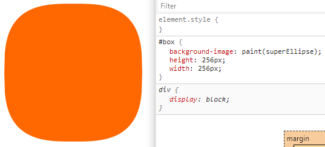

### Generalizing

The troll is playing with the keyboard and say: your code will not work if the DOM is not `256px` because you made the height and width fixed.

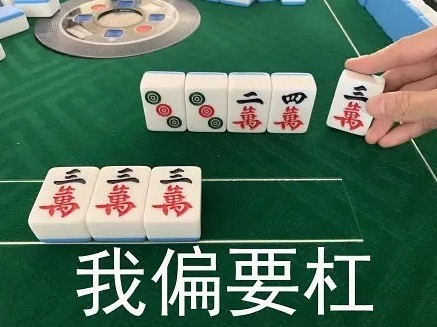

Interesting. I'll make you regret.


The `paint` of class inside `registerPaint` have other three parameters like `paint(ctx, geom, props, args)`, besides `ctx`.

- `ctx` is the context of `canvas` drawing.

- The second parameter tells us the width and the height of the canvas that is at our disposal.

- The third paramter is the CSS properties the paint worklet can access.

- The fourth paramter is the extra array of paramters to be used in `paint` (Chrome 89+).

Obviously, we can use the second parameter to get the DOM height and width.

```
registerPaint(
  "superEllipse",
  class {
    // custom properties
    static get inputProperties() {
      // n - the exponent of Lame curve
      return ["--n"];
    }

    paint(ctx, geom, props) {
      const { height, width } = geom;
      const exp = props.get("--n")?.[0] || 3;

      const calcY = (x) => ((width / 2) ** exp - x ** exp) ** (1 / exp);

      ctx.setTransform(1, 0, 0, 1, width / 2, height / 2);
      ctx.beginPath();

      for (let i = -width / 2; i <= width / 2; i++) {
        const j = calcY(Math.abs(i));
        ctx.bezierCurveTo(i, j, i, j, i, j);
      }

      for (let i = width / 2; i >= -width / 2; i--) {
        const j = -calcY(Math.abs(i));
        ctx.bezierCurveTo(i, j, i, j, i, j);
      }

      ctx.closePath();
      ctx.fillStyle = "#ff6700";
      ctx.fill();
    }
  }
);
```

The mobile browser support for CSS Houdini is not that good at the moment, and it may not work on mobile devices.

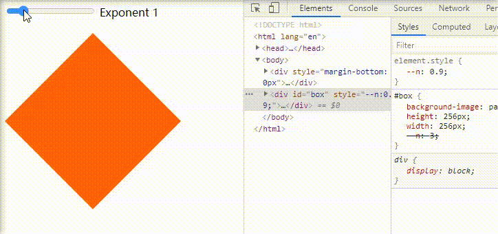

<a href="https://chiumungzitalexander.github.io/superellipse-css-houdini/" target="_blank">Demo</a>

At the end of last, let's draw Xiaomi new logo by pure CSS.

**How about rewarding me a Mi cars, Leibs?**


