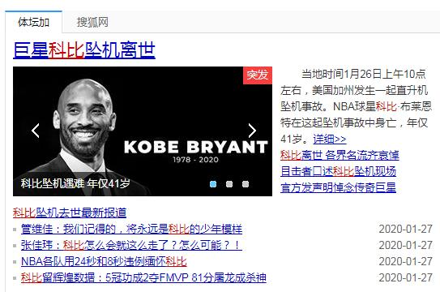

去年的今天，还沉浸在过年的气氛中。一向不理会我睡懒觉的老妈，今天反常地天蒙蒙亮便把我拍醒。

“科比死了。”北方方言死了就是死了，并没有任何不尊重的意思在里面。

我很不耐烦，用手招手老妈道：“你少看点这样的垃圾新闻，怎么可能？”

老妈平时用手机没少被我训斥，便离开去准备早饭。

如果是听到某个明星死了，我会毫无犹豫地继续睡觉。但是听到科比的瞬间，心里多多少少还是咯噔了一下子。

半信半疑地打开了新闻，头条消息便是“科比的直升机坠毁，包括科比和其二女儿GiGi在内全部机上人员丧生。”

脑子里全是科比1V5拉杆上篮、打板绝杀热火、罚球线飞扣大本、变向加360度妙传图里亚夫、晃过皮蓬助攻奥尼尔等等等等这些画面。然而马上便陷入了一片空白。

一遍又一遍地刷新着网页，只希望这是一个虚假的新闻。结果却是越来越多的现场报道及图片。

