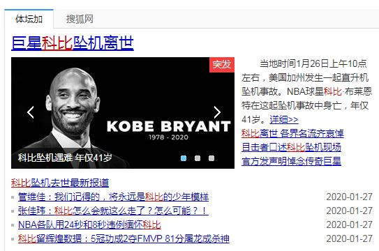
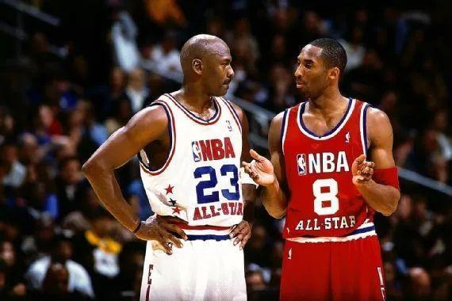
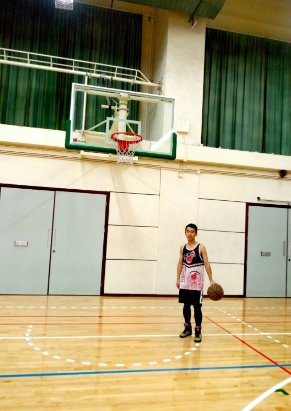

Chap 0

On this day last year, all basked in the happiness of Chinese new year. However, my mom, who never cared about my oversleeping, woke me up even before dawn.

"Kobe died." She told me directly without any offense against Kobe.

"Impossible! Keep away from junk news!" I lost my patience and drove her away.

She went to prepare the breakfast after my scold.

When opened the news app in doubt, breaking one - "Kobe Bryant, daughter among 9 killed in California helicopter crash." made me shocked.

It came to my mind that Kobe's double pump layup againt 5 Spurs, bank shot buzzer beater against Wade, free throw line dunk on Wallace, 360 cross over assist to Turiaf and alleyoop to Shaq over Pippen etc. But in a suddon, I couldn't see anything anymore.

I tried to refresh the page time and time again, to wish this was fake news. Nevertheless more and more live news and photos arrived.

Although it was the Spring Festival, I wasn't excited at all.

The idol means no less than brothers, sometimes.

 
Chap 1

When I was young, I preferred Yao Ming and LBJ to Kobe. The reason for Yao is obvious. I loved LBJ because he was the selected one and the king. I hated Kobe because of his selfishness -- he would rather take the tough shot than pass to the open teammates.

So when did I start to love Kobe? I don't know. But it must be after I had my own career.

When I faced kinds of difficulties of my job, I started to know he was selfish not because he wanted to show or to dominate; but because he insisted to take the charge as the ourstanding star of the team.

I knew lots of mediocre people. They had one common feature -- when problems occurred, they complained or asked for help without any own thought. I guess a mediocre basketball player wouldn't be punished if he chose to pass the ball when they trailed or gave up the match.

Kobe rejected to do so. He trusted teammates but he didn't depend on teammates on such moment.

He's the one who's not afraid of lost, who would never give up, and who takes the responsibilities when even to fail.

Responsibilities.

Yes, indeed I started to love Kobe after I took my career. I don't need to take the responsibilities before finding a job. ask for parents if no money; broke up with the girlfriend if not satisfied; copy the homework if not finished.

But now, who would like to help your work?

Life was just like a box of responsibilities. Kobe is one of the best pattern of taking responsibilities.

 
Chap 2

Kobe wasn't top talent in NBA. He went behind the GOAT MJ by strength, shoulder width, and especially the hand size.

But he made it. He became the one closest to the god of basketball.

I believe the only reason is Kobe's answer to one interview long ago:

"Have you seen Los Angeles at 4am?"

Many basketball players had ever seen LA at 4am, even NYC and Boston. They were familiar with the environment of the night clubs at 4am.

I always keep the opinion that the talent determines the ceiling, while the hardworking, the floor.

One interesting thing is that I had a friend by playing basketball. He was too plain to perform fade away jumper or have shots like Curry. But his offensive and defensive clutch must be beyond the average. I was told he had watched the basketball video and had practised for the whole summer holidays.

Without almost crazy training, Kobe could be another role player named Bryant.

Hardworking.

In current involuted society, move forward, or you'll fall behind. Kobe is one of the best pattern of hardworking.

 
Chap 3

I have read lots of blogs about saying goodbye to Kobe and black mamba during the deathday of him.

I just wonder who or what we're saying goodbye to.

Absolutely it is Kobe, but it seems not only to be Kobe.

The early Kobe fans are going to work, to marry and to bear the children. The basketball is flat and the jersey is folded. Sometimes when passing by the basketball court, I will envy the students in uniform and cheap sneakers, without any gears .

Well, finally I got the answer.

We're saying goodbye to ourselves as well, who used to be irresponsible and undisciplined.

However, we embraced the spiritual wealth Kobe left - the mamba mentality.

Goodbye, Kobe.

(Kobe 9 High，Gym of HKBU, 2016)

