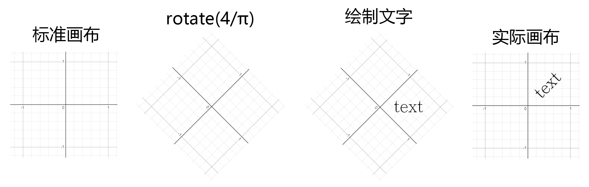
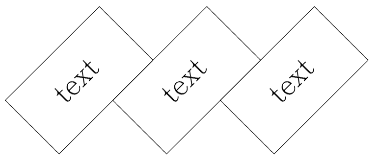
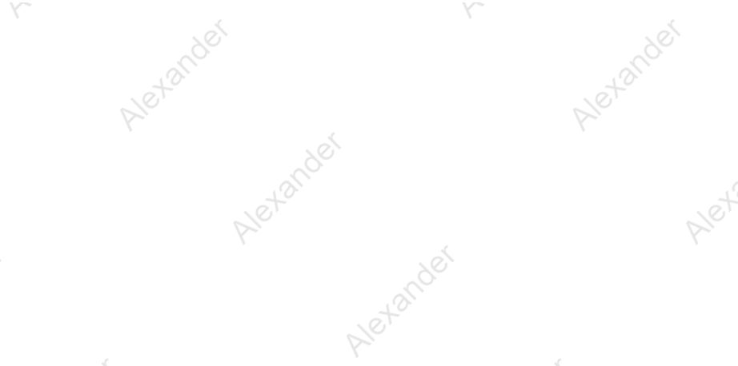
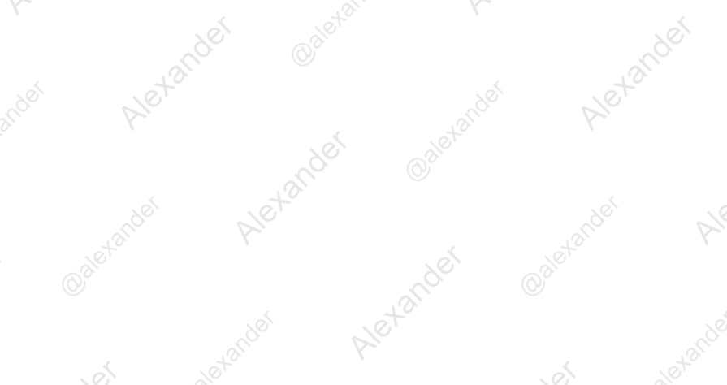
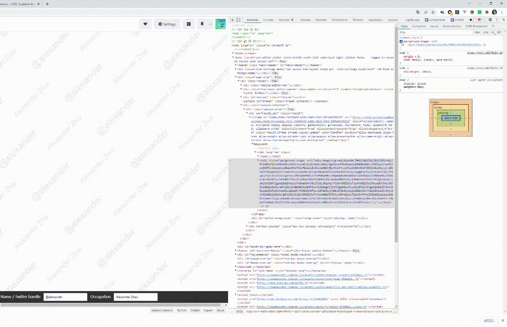
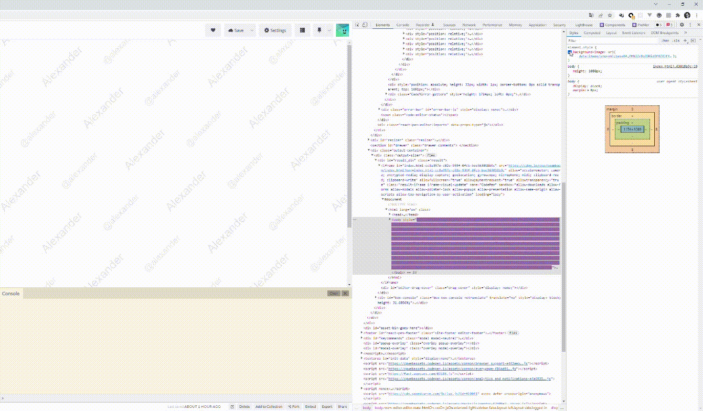

所谓前端水印(watermark)指的就是这玩意。


说起来我的第一反应还是用`canvas`来做。

### canvas 实现

`canvas`对于文字的表现个人认为并不算非常友好。一共只有两个 API 可以绘制文字，分别是`fillText`和`strokeText`。

同时呢，对于非水平方向上的文字，只能通过画布的`rotate`来实现。如下图。



麻烦的地方在于，`canvas`的绘制是顺序的，如果是重复绘制文字呢，需要做非常复杂的笛卡尔坐标计算。既便使用`translate`循环重置坐标原点，仍然不是一种很直接方式。

```
window.onload = function() {
  // get parent element height and width
  const main = document.querySelector('main');

  const HEIGHT = main.offsetHeight;
  const WIDTH = main.offsetWidth;

  // get cvs and set height and width by parent
  const cvs = document.getElementById('watermark');

  cvs.height = HEIGHT;
  cvs.width = WIDTH;

  const ctx = cvs.getContext('2d');

  ctx.font = "30px Arial";
  ctx.fillStyle = 'rgba(0, 0, 0, 0.2)';
  ctx.textBaseline = "top";

  const TEXT_WIDTH = ctx.measureText('alexander').width;

  ctx.translate(5, TEXT_WIDTH * Math.sqrt(2) / 2 + 5);
  ctx.rotate(-Math.PI / 4);
  ctx.fillText('alexander', 0, 0, TEXT_WIDTH);

  ctx.resetTransform();

  // calculate coordinates and repeat
  ctx.translate(5 + 5 + TEXT_WIDTH, TEXT_WIDTH * Math.sqrt(2) / 2 + 5);
  ctx.rotate(-Math.PI / 4);
  ctx.fillText('alexander', 0, 0, TEXT_WIDTH);
}
```

另一种思路呢就是渲染多个同样的、只包含一个文字的 canvas。像这样。



也不好，为什么呢？页面大了之后多了很多`canvas`，对性能上是有一定影响的。

这不禁令我陷入沉思。没有更好的方法了吗？


隔了几天有个小弟问我 svg 的图怎么改颜色。作为一个逼王，我突然嗅到了一个能装逼的机会。

canvas 能做的，svg 也能做，不妨试试？

### svg 实现

svg 对于这种重复性的图形或文字渲染是有先天优势的，因为 svg 有一个功能强大的`<pattern>`。

详见 https://developer.mozilla.org/en-US/docs/Web/SVG/Element/pattern

在`<pattern>`中定义文字并 fill，听起来就很高大上。

```
<svg id="watermark" xmlns="http://www.w3.org/2000/svg" xmlns:xlink="http://www.w3.org/1999/xlink" width="100%" height="100%">
  <style type="text/css">text { fill: rgba(0,0,0,0.1); font-family: Avenir, Arial, Helvetica, sans-serif; }</style>
  <defs>
    <pattern id="name-pattern" patternUnits="userSpaceOnUse" width="400" height="200">
      <text y="30" font-size="40" id="name">Alexander</text>
    </pattern>
    <pattern id="repeat" href="#name-pattern" patternTransform="rotate(-45)">
      <use href="#name" />
    </pattern>
  </defs>
  <rect width="100%" height="100%" fill="url(#repeat)" />
</svg>
```

看下效果。



有些简单了，搞复杂一点。

```
<svg id="watermark" xmlns="http://www.w3.org/2000/svg" xmlns:xlink="http://www.w3.org/1999/xlink" width="100%" height="100%">
  <style type="text/css">text { fill: rgba(0,0,0,0.1); font-family: Avenir, Arial, Helvetica, sans-serif; }</style>
  <defs>
    <pattern id="pattern" patternUnits="userSpaceOnUse" width="400" height="200">
      <text y="30" font-size="40" id="name">Alexander</text>
    </pattern>
     <pattern href="#pattern">
      <text x="200" y="120" font-size="30" id="at">@alexander</text>
    </pattern>
    <pattern id="repeat" href="#pattern" patternTransform="rotate(-45)">
      <use href="#name" />
      <use href="#at" />
    </pattern>
  </defs>
  <rect width="100%" height="100%" fill="url(#repeat)" />
</svg>
```



为了不增加额外的DOM节点，我们用binary的方式将其作为CSS `background-image`至`body`。

```
const rawSVGString = '<svg id="watermark" xmlns="http://www.w3.org/2000/svg" xmlns:xlink="http://www.w3.org/1999/xlink" width="100%" height="100%">
  <style type="text/css">text { fill: rgba(0,0,0,0.1); font-family: Avenir, Arial, Helvetica, sans-serif; }</style>
  <defs>
    <pattern id="pattern" patternUnits="userSpaceOnUse" width="400" height="200">
      <text y="30" font-size="40" id="name">Alexander</text>
    </pattern>
    <pattern href="#pattern">
      <text x="200" y="120" font-size="30" id="at">@alexander</text>
    </pattern>
    <pattern id="repeat" href="#pattern" patternTransform="rotate(-45)">
      <use href="#name" />
      <use href="#at" />
    </pattern>
  </defs>
  <rect width="100%" height="100%" fill="url(#repeat)" />
  </svg>';

document.body.style.backgroundImage = `url('data:image/svg+xml;base64,${window.btoa(rawSVGString)}')`;
```


### 并不优雅

弄完之后我发现了一个重大的漏洞，就是如果用户是同样略懂前端的装逼犯，他就会按F12打开Console把你body的样式改了，水印就没了。



有没有什么方法能阻止用户去hack Console呢？

这个还真没有。

但是同样地，为什么不换个思路呢————比如有没有什么listener可以监听用户去hack呢？

这个可以有，那就是`Mutation Observer`。 https://developer.mozilla.org/en-US/docs/Web/API/MutationObserver

简单来说，这个东西就是允许用户自定义观察者，并对mutation做出反应。

```
const observer = new MutationObserver((mutationsList, observer) => {
  // mutation回调
});

observer.observe(
  document.querySelector("body"), // 作为观察者的节点
  {  attributes: true } // 需要观察的属性
);
```

我们来优化一下。

```
const rawSVGString =
  '<svg id="watermark" xmlns="http://www.w3.org/2000/svg" xmlns:xlink="http://www.w3.org/1999/xlink" width="100%" height="100%"><style type="text/css">text { fill: rgba(0,0,0,0.1); font-family: Avenir, Arial, Helvetica, sans-serif; }</style><defs><pattern id="pattern" patternUnits="userSpaceOnUse" width="400" height="200"><text y="30" font-size="40" id="name">Alexander</text></pattern><pattern href="#pattern"><text x="200" y="120" font-size="30" id="at">@alexander</text></pattern><pattern id="repeat" href="#pattern" patternTransform="rotate(-45)"><use href="#name" /><use href="#at" /></pattern></defs><rect width="100%" height="100%" fill="url(#repeat)" /></svg>';

document.body.style.backgroundImage = `url('data:image/svg+xml;base64,${window.btoa(
  rawSVGString
)}')`;

const observer = new MutationObserver((mutationsList, observer) => {
  for (const mutation of mutationsList) {
    if (mutation.type === "attributes" && mutation.attributeName === "style") {
      document.body.style.backgroundImage = `url('data:image/svg+xml;base64,${window.btoa(
        rawSVGString
      )}')`;
    }
  }
});

observer.observe(document.querySelector("body"), {
  attributes: true,
  attributeFilter: ["style"]
});
```

现在你怎么改`body`的样式watermark都消不掉了。因为任何对`body`的hack都会导致watermark重新绘制。



### Mutation Observer and Event Listener

随着负责了一些大型项目的架构设计，逐渐对设计模式有了“不只限于背定义”的理解。

简言之，Mutation Observer是观察者模式，但是EventListener是观察者模式吗？看着像，但我个人认为不算是观察者模式。

第一，观察者模式下，观察者观察的是某个object的变化。所以Mutation Observer肯定符合。但是EventListener监听的是事件，换言之更像是一种hooks。数据驱动和事件驱动在本质是有区别的。

第二，观察者模式下的任何变化，会通知到所有的观察者；而EventListener则是去触发调度器(Mediator)。

第三，观察者模式是可以是一对多的关系，而EventListener因为存在一个event-handler的map，是一对一的关系。
