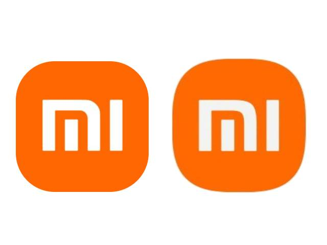
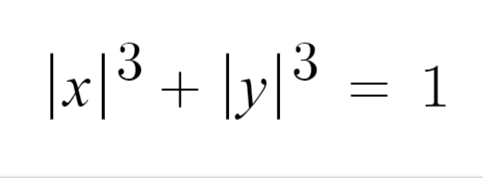
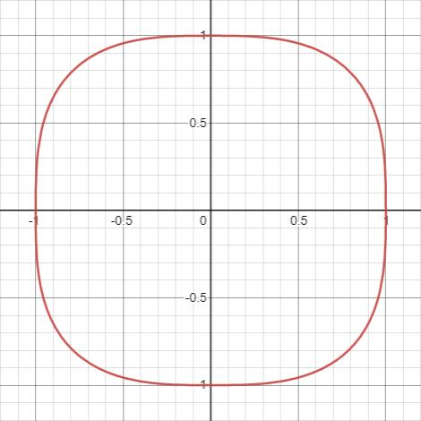

### 前情提示

小米今天换新logo了，据说花了200万。

雷布斯总能在宣传上给我们整点新花样。

网上更是炸翻了天，说一行代码，就值200万？

要不是说雷布斯是个懂营销的程序员呢，普普通通换个logo，小米立马上热搜。一想到小米汽车也要上线了，不得不服雷布斯这波还是有点东西的。

### 事情真的那么简单？

外行看热闹，内行看门道。

这次的设计师**原研哉(はら けんや)**你可能不熟悉。

但是他的设计你肯定知道。没错，他就是无印良品的艺术总监。

一个logo值200万，逼着我又去仔细研究了一下。果不其然，发现了端倪。

首先，这次的logo并不是一行代码那么简单的圆角处理。对比下图。

我这36K纯氪金狗眼都看出了二者的区别。简单来说，左边是圆角，右边是明显不是一般的圆角。

又去看了一下设计理念，这次logo用的是笛卡尔坐标系下的Lamé曲线。也被称为超椭圆。函数图像如下。

那么问题来了，既然不是一行CSS的问题，那如何用CSS画超椭圆呢？

### CSS实现超椭圆

