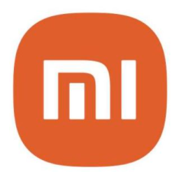
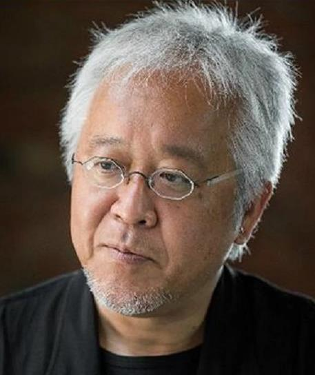
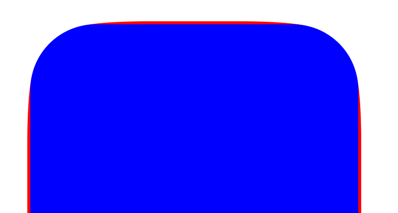
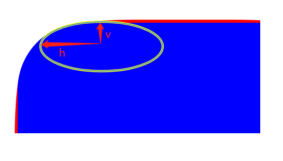
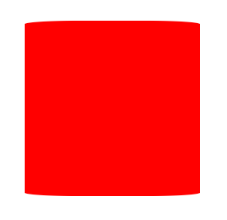
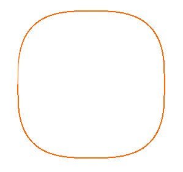
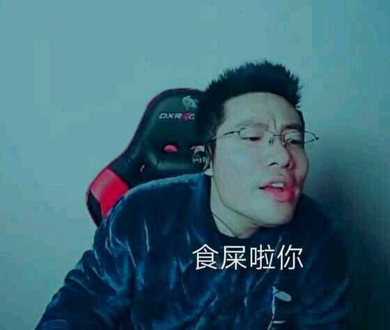
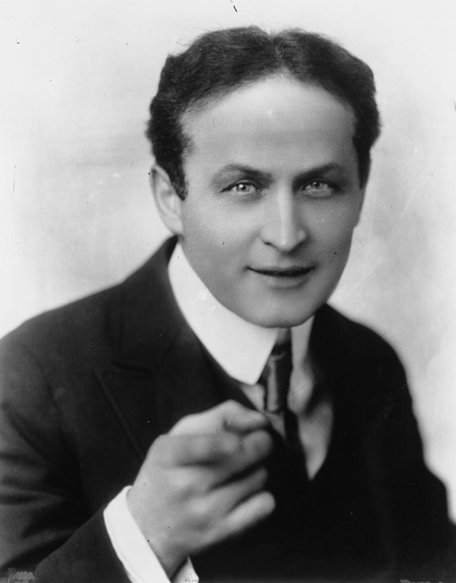

### 前情提示

小米今天换新logo了，据说花了200万。

雷布斯总能在宣传上给我们整点新花样。

网上更是炸翻了天，说一行代码，就值200万？  

要不是说雷布斯是个懂营销的程序员呢，普普通通换个logo，小米立马上热搜。一想到小米汽车也要上线了，不得不服雷布斯这波还是有点东西的。

### 事情真的那么简单？

外行看热闹，内行看门道。

这次的设计师**原研哉(はら けんや)**你可能不熟悉。

但是他的设计你肯定知道。没错，他就是无印良品的艺术总监。

一个logo值200万，逼着我又去仔细研究了一下。果不其然，发现了端倪。

首先，这次的logo并不是一行代码那么简单的圆角处理。对比下图。

我这36K纯氪金狗眼都看出了二者的区别。简单来说，左边是圆角，右边是明显不是一般的圆角。

又去看了一下设计理念，这次logo用的是笛卡尔坐标系下的Lamé曲线。也被称为超椭圆。函数图像如下。

那么问题来了，既然不是一行CSS的问题，那如何用CSS画超椭圆呢？

### CSS实现超椭圆

比较一下超椭圆和圆角的区别。

差异主要是处理红色部分的外凸。如果你熟悉PS，用过铅笔工具，很轻易了解这里需要调整切线的轴线长度。不了解也没关系，用大白话来说，弯角部分的弧线，不是正圆，而是椭圆。

那么用`border-radius`怎么能实现一个轴长不等的椭圆角呢？这个时候我们回归文档看一下。

MDN关于`border-raiuds`有这么一小行字 **followed optionally by "/" and one, two, three, or four <length> or <percentage> values. This is used to set an additional radius, so you can have elliptical corners.**。我就不翻译了，北京海淀区幼儿园的英语句型。

也就是说，在`/`前面的数值，是h轴的长度，后面的数值是v轴的长度。

来实现一下这种圆角。
<pre>
.super-ellipse {
  border-radius: 30% / 2%;
  height: 220px;
  position: relative;
  width: 220px;
}
</pre>

仿佛是这种套路。但很明显，这种方法只定义了h/v的比，导致只有矩形的上下两边外凸。因此我们还需要在左右两边实现同样的效果。最简单的方式是使用伪元素。
<pre>
.super-ellipse {
  height: 220px;
  position: relative;
  width: 220px;
}

.super-ellipse::after,
.superellipse::before {
  background-color: red;
  content: "";
  position: absolute;
  z-index: -1;
}

.super-ellipse::before {
  border-radius: 2% / 30%;
  bottom: 0;
  left: 0;
  right: 0;
  top: 0;
}

.super-ellipse::after {
  border-radius: 30% / 2%;
  left: 0;
  right: 0;
  top: 0;
  bottom: 0;
}
</pre>

但是这样有个问题，外凸的弧线被另一个方向的元素遮挡了。我们调整一下伪元素宽高。

<pre>
.super-ellipse {
  height: 220px;
  position: relative;
  width: 220px;
}

.super-ellipse::after,
.superellipse::before {
  background-color: red;
  content: "";
  position: absolute;
  z-index: -1;
}

.super-ellipse::before {
  border-radius: 2% / 30%;
  bottom: 33px;
  left: 0;
  right: 0;
  top: 33px;
}

.super-ellipse::after {
  border-radius: 30% / 2%;
  bottom: 0;
  left: 33px;
  right: 33px;
  top: 0;
}
</pre>

红十字会来了。我们最后给父元素一个`border-radius`并上色看看，再微调一下伪元素的位置。哦，别忘了小米的配色。

<pre>
.super-ellipse {
  background-color: #ff6700;
  border-radius: 20%;
  height: 220px;
  position: relative;
  width: 220px;
}

.super-ellipse::after,
.superellipse::before {
  background-color: #ff6700;
  content: "";
  position: absolute;
  z-index: -1;
}

.super-ellipse::before {
  border-radius: 2% / 30%;
  bottom: 33px;
  left: -2px;
  right: -2px;
  top: 33px;
}

.super-ellipse::after {
  border-radius: 30% / 2%;
  bottom: -2px;
  left: 33px;
  right: 33px;
  top: -2px;
}
</pre>

除了没有MI的字外，很相近了。
<a href="https://codepen.io/alexanderzhao/pen/jOyyNKR" target="_blank">Demo</a>

### 真的一致了吗？

我相信有些产品秉着“必须与设计稿重合”的原则来衡量上面的成品图，我不得不承认刚刚做出来的效果很相近，但是没到完全一致的程度。

原因在于，椭圆函数曲线与非二次幂的Lamé曲线在图像上根本不可能重合，因此无论你怎么调整`border-radius`都不可能实现非二次幂的Lamé曲线。

那么有没有方法能通过画一条函数曲线，来实现矩形的边角呢？

直觉告诉我应该用`canvas`。可以利用微积分的思想，将所有图像上的点绘制出来并连接。

第一版本我尝试了完全使用直线依次连接所有的点，发现虽然绘制出来了，但是无法填充，且锯齿明显。

<pre>
const canvas = document.getElementById('canvas');
const ctx = canvas.getContext('2d');

const width = 240;
const height = 240;
const calcY = x => ((width / 2)**3 - x**3)**(1 / 3)

ctx.setTransform(1, 0, 0, 1, width / 2 + 8, height / 2 + 8);
ctx.strokeStyle = '#ff6700';
ctx.moveTo(-width / 2, 0);

for (let i = -width / 2; i <= width / 2; i++) {
  const j = calcY(Math.abs(i));
  ctx.lineTo(i, j);
  ctx.stroke();
}

for (let i = width / 2; i >= -width / 2; i--) {
  const j = -calcY(Math.abs(i));
  ctx.lineTo(i, j);
  ctx.stroke();
}
</pre>

行，不就是丝滑么，惊得我吃了两块某芙巧克力，用贝塞尔曲线试试。果不其然，大功告成。

<pre>
const canvas = document.getElementById('canvas');
const ctx = canvas.getContext('2d');

const width = 240;
const height = 240;
const calcY = x => ((width / 2)**3 - x**3)**(1 / 3)

ctx.setTransform(1, 0, 0, 1, width / 2 + 8, height / 2 + 8);
ctx.beginPath()
ctx.moveTo(width / 2 + 8, 0);

for (let i = -width / 2; i <= width / 2; i++) {
  const j = calcY(Math.abs(i));
  ctx.bezierCurveTo(i, j, i, j, i, j);
}

for (let i = width / 2; i >= -width / 2; i--) {
  const j = -calcY(Math.abs(i));
  ctx.bezierCurveTo(i, j, i, j, i, j);
}

ctx.closePath();
ctx.fillStyle = '#ff6700';
ctx.fill();
</pre>

### 进阶思考

这时候突然闯进一只杠精嚷道：`canvas`者不为CSS也。  

行，你神头鬼脸。

`canvas`是HTML元素，的确。那到底有没有一种CSS方法能够让我们去像`canvas`这样自定义地绘制路径呢？

经过一系列研(tou)究(kui)，还别说，在2016年前后诞生的CSS Houdini真可以实现这个需求。

CSS Houdini你可以大致理解为，CSS开放API给开发人员，开发人员通过API自行扩展CSS。这个名字在很多领域都能看得到，基本都和一些视觉效果相关。实际上都是为了纪念Harry Houdini，被称为史上最伟大的魔术师。

CSS Houdini主要提供了6组API，其中Paint API可以满足需求。我们可以使用Paint API自定义`background`的属性值，进而通过遮罩的方式来实现超椭圆的效果。步骤如下：

1. 声明一个`paint.js`开发绘制方法

2. 通过Houdini注册`paint.js`中的方法

3. 为某个元素的`background-image`添加包含`paint.js`提供方法的属性值并用运用遮罩实现超椭圆

