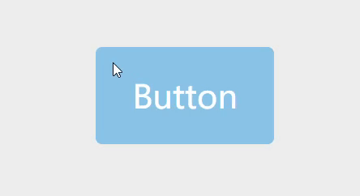

### 实际效果

### 什么是directives？

<a href="https://cn.vuejs.org/v2/guide/custom-directive.html" target="_blank">vue官方文档</a>对directives定义是“自定义指令，用来对DOM元素进行底层操作”。

简单来说，因为MVVM模式是**数据驱动**的，所以不提倡直接操作DOM。但偶尔会遇到必须操作DOM，且逻辑基本一致的情况，使用directives可以抽象逻辑、提高复用。

v-show就是一个典型的directives，本质上v-show只是改变DOM的CSS`{ display: none }`，仅此而已。

### 如何做到ripple效果？
 

##### 1.确定点击/触摸位置
 

<pre>
const posX = e.pageX - e.currentTarget.offsetLeft
const posY = e.pageY - e.currentTarget.offsetTop
</pre>

##### 2.绝对定位添加ripple层
 

<pre>
let spanEl = document.createElement('span');
spanEl.className = 'ripple';
e.currentTarget.appendChild(spanEl);
</pre>

##### 3.CSS圆形扩散效果
 

<pre>
.ripple {
  background: rgba(255, 255, 255, 0.4);
  border-radius: 50%;
  height: 0;
  opacity: 1;
  position: absolute;
  transform: scale(0);
  width: 0;
}

.rippleEffect {
  animation: rippleDrop .6s linear;
}

@keyframes rippleDrop {
  100% {
    transform: scale(2);
    opacity: 0;
  }
}
</pre>

### DEMO

<a href="https://codepen.io/alexanderzhao/pen/NWrrxRy" target="_blank">codepen</a>

### 思考：jQuery实现缺点
 

1. 需要ripple和non-ripple两种组件，代码冗余提高，且不够灵活
2. 在生命周期中执行逻辑没有directives钩子函数清晰
