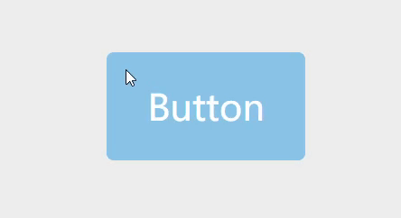

### 实际效果



### 什么是 directives？

<a href="https://cn.vuejs.org/v2/guide/custom-directive.html" target="_blank">vue 官方文档</a>对 directives 定义是“自定义指令，用来对 DOM 元素进行底层操作”。

简单来说，因为 MVVM 模式是**数据驱动**的，所以不提倡直接操作 DOM。但偶尔会遇到多个场景必须操作 DOM，且逻辑基本一致的情况，此时使用 directives 可以抽象逻辑、提高复用。

v-show 就是一个典型的 directives。本质上 v-show 只是改变 DOM 的 CSS`{ display: none }`，仅此而已。

### 如何做到 ripple 效果？

<br />

#### 1. 确定点击/触摸位置


```
const posX = e.pageX - e.currentTarget.offsetLeft
const posY = e.pageY - e.currentTarget.offsetTop
```


#### 2. 绝对定位添加 ripple 层

```
let spanEl = document.createElement('span');
spanEl.className = 'ripple';
e.currentTarget.appendChild(spanEl);
```

#### 3. 添加CSS 圆形扩散效果

```
.ripple {
  background: rgba(255, 255, 255, 0.4);
  border-radius: 50%;
  height: 0;
  opacity: 1;
  position: absolute;
  transform: scale(0);
  width: 0;
}

.ripple-effect {
  animation: ripple-drop .6s linear;
}

@keyframes ripple-drop {
  100% {
    transform: scale(2);
    opacity: 0;
  }
}
```

### <a href="https://codepen.io/alexanderzhao/pen/NWrrxRy" target="_blank">demo</a>

### <br />

### 思考：不使用 directives 实现的缺点

<br />

1. 需要 ripple 和 non-ripple 两种组件，代码冗余提高，且不够灵活
2. 在生命周期中执行逻辑没有 directives 钩子函数清晰
